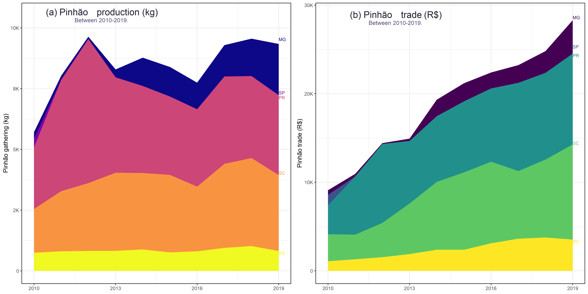
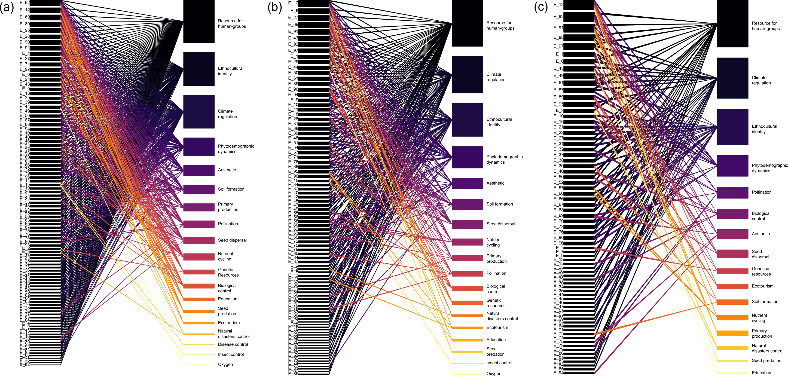

# Disruption Araucaria Forest

# Disrupting a socioecological system: how Traditional Ecological Knowledge could be the key to preserve Araucaria Forest in Brazil under climate change?

The R script `R/r_script.R` can be run to reproduce the results of the following study:

**Mario M. Tagliari*, Juliano A. Bogoni, Graziela D. Blanco, Aline P. Cruz, Nivaldo Peroni**. 2022. 

To run the script, you can either execute the `araucaria_2020.sh` shellscript file or run the R script under a R GUI such as RStudio.

## Data

Data can be found in the `data` folder. The `cap_etno` folder includes the `.csv` file with raw data used in this study.

## Results

All the results are saved in the `outputs` folder.

Figure 1: **The production and value (US$) of pinhao production**.

Figure 2: **Potential lost of ecosystem services due to climate change perceived by TEK holders**.
## License

Data and R script are available under the GNU General Public License version 3 (see `LICENSE` file).
